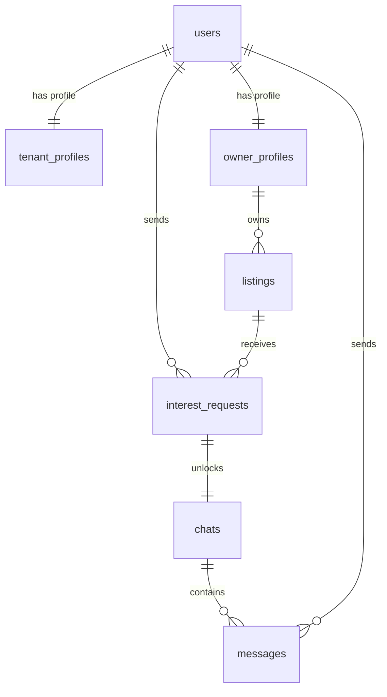

# Staylio Database Schema Documentation

Staylio uses SQLAlchemy ORM mappings to structure its relational database. The tables default to a local SQLite database (`rent_flatmate.db`) in development but support PostgreSQL (e.g., Neon PostgreSQL) in production without code modifications.

---

## 1. Table Definitions

### `users` Table
Stores basic login credentials, roles, and administrative flags.
*   **Columns**:
    *   `id` (Integer, Primary Key)
    *   `email` (String, Unique, Nullable=False)
    *   `password` (String, Nullable=False)
    *   `role` (String, Nullable=False) - Either `'tenant'`, `'owner'`, or `'admin'`
    *   `is_admin` (Boolean, Default=False)
    *   `created_at` (DateTime)
    *   `updated_at` (DateTime)
*   **Relationships**:
    *   `tenant_profile` (one-to-one to `tenant_profiles`)
    *   `owner_profile` (one-to-one to `owner_profiles`)

### `tenant_profiles` Table
Stores roommate search preferences for calculating rule-based compatibilities.
*   **Columns**:
    *   `id` (Integer, Primary Key)
    *   `user_id` (Integer, Foreign Key references `users.id`, Unique)
    *   `preferred_location` (String, Nullable=False)
    *   `budget_min` (Float, Default=0.0)
    *   `budget_max` (Float, Nullable=False)
    *   `move_in_date` (Date, Nullable=False)
    *   `occupation` (String, Nullable=False)
    *   `bio` (Text, Nullable=True)
    *   `lifestyle_habits` (Text, Nullable=True)
    *   `created_at` (DateTime)
    *   `updated_at` (DateTime)

### `listings` Table
Stores owner-posted properties.
*   **Columns**:
    *   `id` (Integer, Primary Key)
    *   `owner_id` (Integer, Foreign Key references `owner_profiles.id`, Nullable=False)
    *   `title` (String, Nullable=False)
    *   `description` (Text, Nullable=False)
    *   `location` (String, Nullable=False)
    *   `address` (String, Nullable=False)
    *   `rent` (Float, Nullable=False)
    *   `contact_info` (String, Nullable=False)
    *   `room_type` (String, Nullable=False)
    *   `furnishing_status` (String, Nullable=False)
    *   `num_rooms` (Integer, Default=1)
    *   `available_from` (Date, Nullable=False)
    *   `amenities` (JSON / pickle array of strings)
    *   `is_filled` (Boolean, Default=False) - Mapped to `Booked` (True) and `Available` (False) status
    *   `created_at` (DateTime)
    *   `updated_at` (DateTime)

### `interest_requests` Table
Tracks sent interest requests.
*   **Columns**:
    *   `id` (Integer, Primary Key)
    *   `tenant_id` (Integer, Foreign Key references `users.id`, Nullable=False)
    *   `listing_id` (Integer, Foreign Key references `listings.id`, Nullable=False)
    *   `status` (String, Default=`'pending'`) - Either `'pending'`, `'accepted'`, or `'rejected'`
    *   `created_at` (DateTime)
    *   `updated_at` (DateTime)

### `chats` Table
Rooms where users communicate.
*   **Columns**:
    *   `id` (Integer, Primary Key)
    *   `request_id` (Integer, Foreign Key references `interest_requests.id`, Unique)
    *   `created_at` (DateTime)

### `messages` Table
Tracks message history.
*   **Columns**:
    *   `id` (Integer, Primary Key)
    *   `chat_id` (Integer, Foreign Key references `chats.id`, Nullable=False)
    *   `sender_id` (Integer, Foreign Key references `users.id`, Nullable=False)
    *   `content` (Text, Nullable=False)
    *   `is_read` (Boolean, Default=False)
    *   `created_at` (DateTime)

---

## 2. Entity-Relationship Diagram (ERD)

